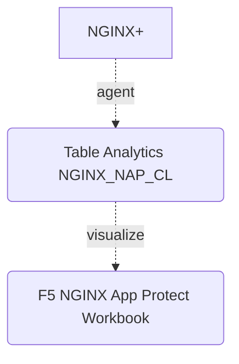

### Introduction

The NGINX App Protect data connector provides the capability to ingest NGINX+ App Protect WAF events into Microsoft Sentinel. Refer to [NGINX+ App Protect log](https://docs.nginx.com/nginx-app-protect-waf/logging-overview/security-log/) documentation for more information.

### Security Log Configuration

- Recommendation log path /var/log/app_protect/policy/*.log
- JSON Config

```json
{
    "filter": {
        "request_type": "all"
    },

    "content": {
        "format": "splunk",
        "max_request_size": "any",
        "max_message_size": "32k",
        "list_delimiter": ";"
    }
}
```

### Diagram



### How-to

**Create Log Analytics**

- Log Analytics workspace > Tables > Create > New custom log (MMA-based)
- Upload sample logs from /var/log/app_protect/<nginx-nap>.log


- Record delimiter new line


- Collection type Linux path to /var/log/app_protect/policy/*.log


- Custom logs name NGINX_NAP with optional description


- Create


**Import Workbook**

- Microsoft Sentinel > Workbooks > Add workbook > Edit > Advanced Editor


- Apply and save workbook

### Dashboard Preview


